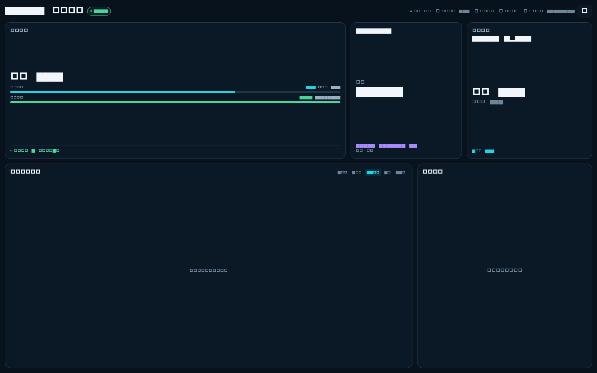

# Codex Quota Monitor / Codex 额度监控

> A local dashboard for viewing Codex usage quotas on an Android tablet.
> 用于在 Android 平板上查看 Codex 用量额度的本地仪表盘。



## What it does / 功能

- Live quota dashboard with a configurable refresh interval and remaining-time display. / 实时额度、可配置刷新间隔与剩余时间展示。
- Local history charts, activity log, and offline display of the last successful data. / 本地历史曲线、活动日志，以及离线时继续展示最后一次成功数据。
- Optional boot-time monitoring, screen wake lock, and a tablet-first landscape layout. / 可选开机监控、常亮和为横屏平板设计的界面。
- Credentials are stored only in platform secure storage; diagnostic exports exclude them. / 凭据只保存到平台安全存储，诊断导出不包含凭据。

## Get started / 开始使用

Requires Flutter 3.44+, Android SDK, and Java 17. / 需要 Flutter 3.44+、Android SDK 和 Java 17。

```powershell
flutter pub get
dart run build_runner build --delete-conflicting-outputs
flutter run

# Build a release APK / 构建正式 APK
flutter build apk --release
```

On first run, import the `auth.json` created by your own Codex CLI installation, or paste its content in the app. The release APK is at `build/app/outputs/flutter-apk/app-release.apk`.
首次运行时，导入你自己的 Codex CLI 生成的 `auth.json`，或在应用中粘贴其内容。正式 APK 位于 `build/app/outputs/flutter-apk/app-release.apk`。

## Security & compatibility / 安全与兼容性

`auth.json` is a login credential: never commit, upload, or share it. This project is local-only and has no remote dashboard. It uses an undocumented Codex/ChatGPT usage endpoint that may change without notice; it is an independent project and is not affiliated with OpenAI.
`auth.json` 属于登录凭据，请勿提交、上传或分享。本项目仅在本地运行，不使用远程仪表盘。它依赖未公开的 Codex/ChatGPT 用量接口，接口可能随时变动；本项目为独立项目，与 OpenAI 无隶属关系。

## License / 许可

Licensed under [MIT](LICENSE). You may use, modify, distribute, and use it commercially, subject to the license notice.
本项目采用 [MIT](LICENSE) 许可证，可自由使用、修改、分发及商用，但需保留许可证声明。
